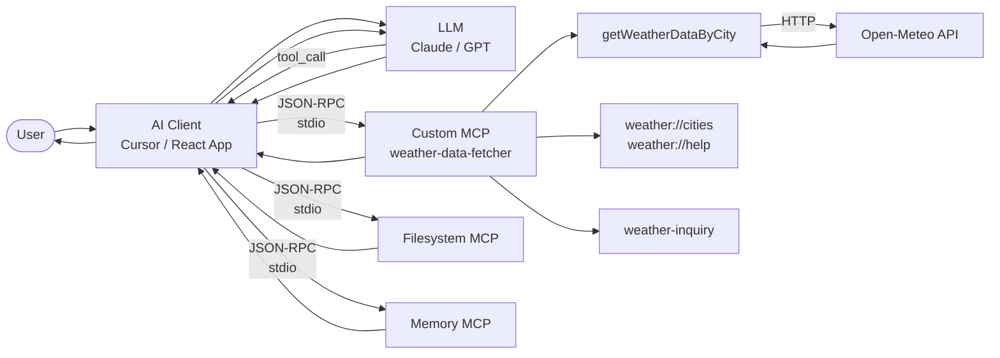
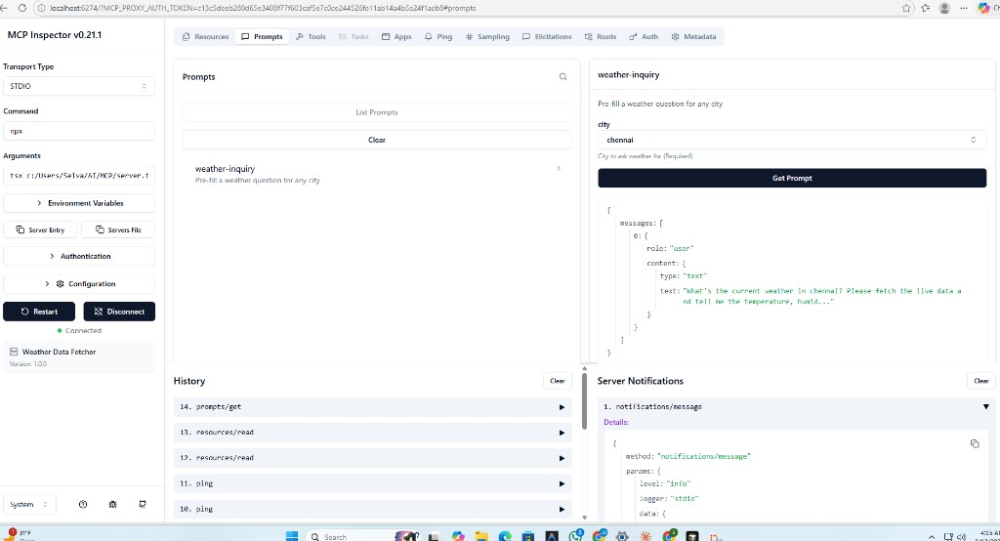

# MCP Weather Tools — AI Tool Integration System

A production-style **Model Context Protocol (MCP)** server that enables AI assistants to call structured tools, read external resources, and use prompt templates — demonstrated through a live weather data integration with a React frontend.

[](https://www.typescriptlang.org/)
[](https://modelcontextprotocol.io/)
[](https://react.dev/)
[](https://nodejs.org/)

---

## Problem Statement

Large Language Models are powerful at reasoning and generating text, but they cannot access live data or perform real-world actions on their own. When a user asks "What's the weather in Tokyo?", the LLM has no built-in mechanism to query a weather API and return current conditions.

**Model Context Protocol (MCP)** solves this by providing a standardized interface between AI assistants and external tools. This project implements a complete MCP server that:

- Registers callable **tools** that the LLM invokes during a conversation
- Exposes read-only **resources** the LLM can query for context
- Provides reusable **prompt templates** that pre-fill structured queries
- Returns **structured JSON responses** the LLM uses to generate accurate answers

---

## Architecture Overview



**Flow:** User asks a question → LLM determines which tool to use → MCP client sends JSON-RPC to the appropriate server (custom weather, filesystem, or memory) → server executes → structured response flows back → LLM composes a natural language answer.

---

## Features

| Capability | Description |
|------------|-------------|
| **Custom + Official MCP** | Local MCP server plus Anthropic’s official servers ([filesystem](https://www.npmjs.com/package/@modelcontextprotocol/server-filesystem), [memory](https://www.npmjs.com/package/@modelcontextprotocol/server-memory)); showcases big-company MCP integration |
| **Tool Registration** | Declarative tool definitions with Zod schema validation on inputs |
| **Structured Responses** | Tools return typed JSON that the LLM can reliably parse |
| **Modular Tool Design** | Shared business logic (`weather.ts`) consumed by both MCP server and REST API |
| **Resource Endpoints** | Read-only data exposed via `weather://` URI scheme |
| **Prompt Templates** | Pre-built prompt structures with argument interpolation |
| **Input Validation** | Zod schemas enforce type safety at the protocol boundary |
| **REST API Bridge** | Express server exposes MCP capabilities as HTTP endpoints for browser clients |
| **React Frontend** | Interactive UI demonstrating all three MCP primitives (tools, resources, prompts) |

---

## Tech Stack

| Layer | Technology | Purpose |
|-------|-----------|---------|
| MCP Server | `@modelcontextprotocol/sdk`, TypeScript | Tool registration, JSON-RPC handling, stdio transport |
| Validation | Zod | Input schema enforcement at protocol boundary |
| External API | Open-Meteo (free, no key) | Geocoding + weather forecast data |
| REST Bridge | Express, CORS | HTTP API for browser-based clients |
| Frontend | React 19, TypeScript, Vite | Interactive demo of MCP capabilities |
| Dev Tools | tsx, concurrently | Development server, parallel process management |
| Protocol | JSON-RPC 2.0 over stdio | MCP transport layer |

---

## Installation & Running

```bash
# Clone the repository
git clone https://github.com/selva/mcp-weather-tools.git
cd mcp-weather-tools

# Install server dependencies
npm install

# Install client dependencies
cd client
npm install
cd ..
```

## Running

```bash
npm run demo
```

Then open **http://localhost:5173**

---

## Example Tool Call

### JSON-RPC Request (MCP Client → Server)

```json
{
  "jsonrpc": "2.0",
  "id": 1,
  "method": "tools/call",
  "params": {
    "name": "getWeatherDataByCity",
    "arguments": {
      "city": "Tokyo"
    }
  }
}
```

### JSON-RPC Response (Server → Client)

```json
{
  "jsonrpc": "2.0",
  "id": 1,
  "result": {
    "content": [
      {
        "type": "text",
        "text": "{\"temp\":\"22°C\",\"humidity\":\"65%\",\"weather\":\"Partly cloudy\",\"wind\":\"12 km/h\",\"city\":\"Tokyo\",\"country\":\"Japan\"}"
      }
    ]
  }
}
```

### REST API Equivalent

```bash
curl http://localhost:3001/api/weather?city=Tokyo
```

```json
{
  "temp": "22°C",
  "humidity": "65%",
  "weather": "Partly cloudy",
  "wind": "12 km/h",
  "city": "Tokyo",
  "country": "Japan"
}
```

---

## Project Structure

```
mcp-weather-tools/
├── server.ts              # MCP server — tool, resource, prompt registration
├── weather.ts             # Shared business logic (Open-Meteo API client)
├── api/
│   └── index.ts           # Express REST API — HTTP bridge for browser clients
├── client/                # React frontend (Vite + TypeScript)
│   ├── src/
│   │   ├── App.tsx        # Main UI — weather, cities, prompt, about tabs
│   │   ├── App.css        # Dark theme styling
│   │   └── api.ts         # Typed fetch wrappers for REST endpoints
│   └── vite.config.ts     # Dev proxy /api → localhost:3001
├── docs/
│   ├── images/            # Screenshots (MCP Inspector, etc.)
│   ├── architecture.md   # Detailed MCP architecture explanation
│   ├── third-party-mcp.md # Using official MCP servers (filesystem, memory)
│   ├── adding-tools.md   # Guide: how to add new tools to this server
│   ├── request-flow.md   # Step-by-step MCP request lifecycle
│   ├── demo.md           # Example conversation walkthrough
│   └── demo-video-script.md
├── SECURITY.md            # AI tool system security considerations
├── package.json
├── tsconfig.json
└── README.md
```

---

## MCP Capabilities

### Tools (Actions)

| Tool | Input | Output | Description |
|------|-------|--------|-------------|
| `getWeatherDataByCity` | `{ city: string }` | Weather JSON | Geocodes city, fetches live forecast from Open-Meteo |

### Resources (Read-only Data)

| URI | MIME Type | Description |
|-----|-----------|-------------|
| `weather://cities` | `text/plain` | Newline-separated list of example cities |
| `weather://help` | `text/plain` | Usage instructions for the weather server |

### Prompts (Templates)

| Prompt | Arguments | Description |
|--------|-----------|-------------|
| `weather-inquiry` | `{ city: string }` | Pre-fills: "What's the current weather in {city}?" |

---

## Cursor IDE Integration

Add to `.cursor/mcp.json`:

```json
{
  "mcpServers": {
    "weather-data-fetcher": {
      "command": "npx",
      "args": ["tsx", "server.ts"],
      "cwd": "/path/to/mcp-weather-tools"
    },
    "filesystem": {
      "command": "npx",
      "args": ["-y", "@modelcontextprotocol/server-filesystem", "/path/to/your/project"]
    },
    "memory": {
      "command": "npx",
      "args": ["-y", "@modelcontextprotocol/server-memory"]
    }
  }
}
```

This config runs **both**:
- **Custom server** (`weather-data-fetcher`) — our local MCP with `getWeatherDataByCity`, resources, prompts
- **Official servers** (`filesystem`, `memory`) — Anthropic’s [@modelcontextprotocol](https://github.com/modelcontextprotocol/servers) servers for file operations and persistent memory

Then ask in Cursor chat: *"What's the weather in London?"* or *"Read docs/architecture.md"* — the LLM can call tools from any server.

---

## MCP Inspector

Use the [MCP Inspector](https://github.com/modelcontextprotocol/inspector) to debug and test the server — call tools, read resources, and try prompts without Cursor.

```bash
npm run inspector
```

This opens a web UI where you can list and invoke tools, read resources (`weather://cities`, `weather://help`), and test the `weather-inquiry` prompt with any city.



---

## Security Considerations

See [SECURITY.md](SECURITY.md) for a detailed analysis. Key points:

- **Input validation** — All tool inputs validated through Zod schemas before execution
- **No arbitrary code execution** — Tools perform specific, scoped operations only
- **External API isolation** — Weather logic is the only outbound network call; no user-controlled URLs
- **Prompt injection awareness** — Tool responses are structured JSON, not raw user input passed to system prompts
- **No secrets in transport** — Open-Meteo requires no API keys; no credentials cross the stdio boundary

---

## Future Improvements

| Area | Enhancement |
|------|-------------|
| **Authentication** | API key or OAuth for REST endpoints |
| **Rate Limiting** | Token bucket per client to prevent tool abuse |
| **Sandboxed Execution** | Run tools in isolated containers or V8 isolates |
| **Logging & Monitoring** | Structured logging with correlation IDs per request |
| **Tool Registry** | Dynamic tool loading from a plugin directory |
| **Caching** | TTL-based response cache for repeated city lookups |
| **Error Classification** | Distinguish retriable vs. permanent failures in tool responses |
| **Multi-tool Orchestration** | Chain tools (e.g., get cities → get weather for each) |

---

## Documentation

| Document | Description |
|----------|-------------|
| [Architecture](docs/architecture.md) | MCP protocol deep-dive, component interaction, transport layer |
| [Third-Party MCP Integration](docs/third-party-mcp.md) | Using external MCP servers alongside the custom server |
| [Adding Tools](docs/adding-tools.md) | Developer guide for registering new MCP tools |
| [Request Flow](docs/request-flow.md) | Step-by-step lifecycle of an MCP request |
| [Demo Walkthrough](docs/demo.md) | Example conversations showing tool calls in action |
| [Security](SECURITY.md) | Threat model and mitigation strategies for AI tool systems |
---

## License

MIT
