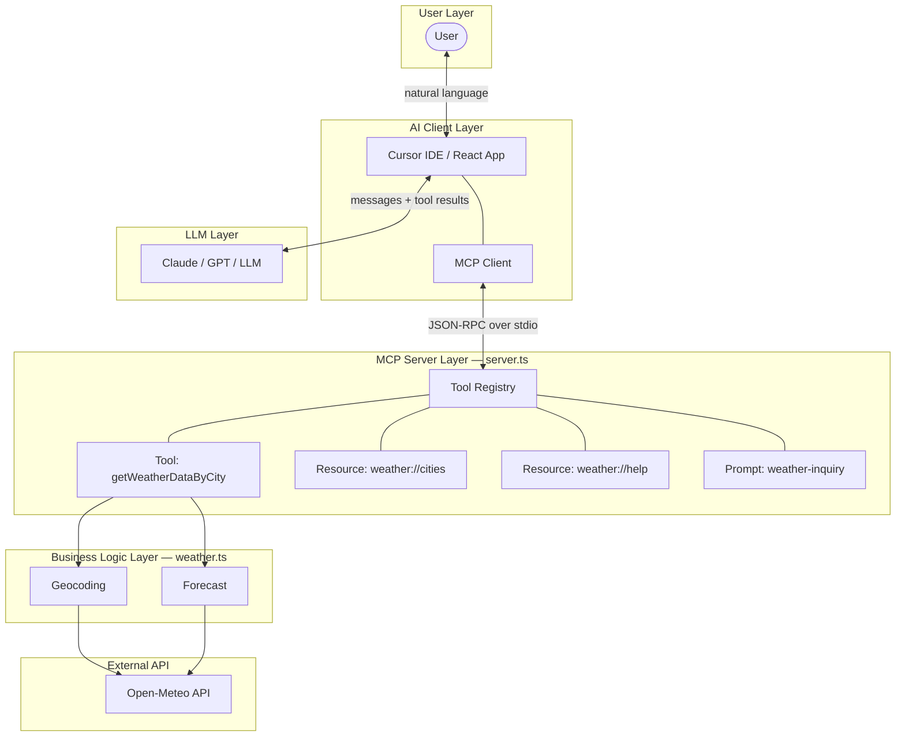
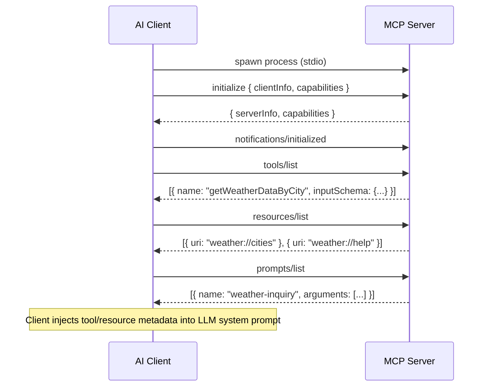
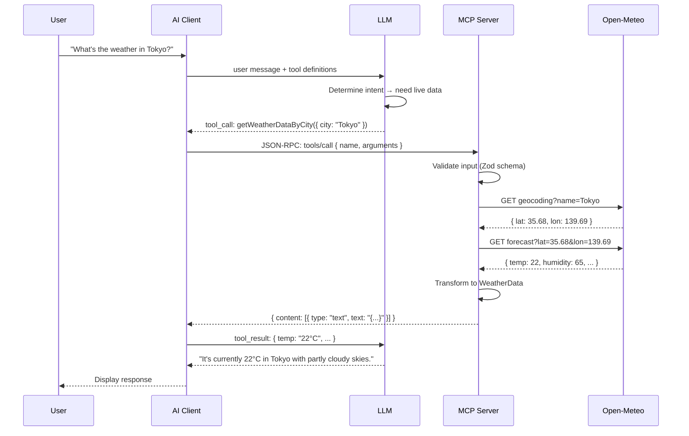

# Architecture — MCP Weather Tools

## What is MCP?

**Model Context Protocol (MCP)** is an open standard created by Anthropic that defines how AI applications communicate with external tool servers. It provides a unified interface for LLMs to discover, invoke, and receive results from tools — without each AI client implementing custom integrations.

MCP is to AI tool calling what USB is to hardware peripherals: one protocol, any combination of clients and servers.

### Core Primitives

| Primitive | Purpose | Direction | Example |
|-----------|---------|-----------|---------|
| **Tools** | Executable actions with side effects | Client → Server → External API | Fetch weather, query database, send email |
| **Resources** | Read-only data at addressable URIs | Client → Server (local data) | City list, help text, configuration |
| **Prompts** | Reusable message templates | Client → Server (template engine) | Pre-filled weather inquiry for a city |

---

## How MCP Differs from Traditional APIs

| Aspect | Traditional REST API | MCP Server |
|--------|---------------------|------------|
| **Consumer** | Human developer writes integration code | LLM decides when and how to call tools |
| **Discovery** | Read API docs manually | Client auto-discovers via `tools/list`, `resources/list`, `prompts/list` |
| **Transport** | HTTP over network | JSON-RPC over stdio (process-to-process) |
| **Schema** | OpenAPI / Swagger | Zod schemas compiled to JSON Schema, embedded in tool metadata |
| **Invocation** | Developer writes `fetch()` call | LLM emits `tool_call` → client sends JSON-RPC → server executes |
| **Response** | Raw HTTP response | Structured `content` array with typed blocks (text, image, etc.) |
| **Lifecycle** | Stateless request/response | Long-lived subprocess with bidirectional communication |

The key shift: **the LLM becomes the API consumer**. The developer's job is to register well-described tools — the LLM handles routing, parameter extraction, and result interpretation.

---

## System Architecture



---

## Component Interaction

### Initialization Sequence

When the AI client starts, it spawns the MCP server as a subprocess and discovers its capabilities:



After initialization, the client knows every capability the server offers and injects this metadata into the LLM's context. The LLM can then decide when to invoke tools during a conversation.

### Request Lifecycle



---

## Transport Layer: JSON-RPC over stdio

MCP uses **JSON-RPC 2.0** as its message format, transported over the process's **stdin** (client → server) and **stdout** (server → client).

### Why stdio?

| Benefit | Explanation |
|---------|-------------|
| **No network setup** | No ports, no firewall rules, no TLS certificates |
| **Process isolation** | Server runs as a child process with its own memory space |
| **Lifecycle control** | Client starts and stops the server; no orphaned processes |
| **Security** | No network exposure; communication is process-local |

### Message Format

Each message is a single JSON line terminated by `\n`:

```
→ stdin:  {"jsonrpc":"2.0","id":1,"method":"tools/call","params":{"name":"getWeatherDataByCity","arguments":{"city":"Tokyo"}}}\n
← stdout: {"jsonrpc":"2.0","id":1,"result":{"content":[{"type":"text","text":"{\"temp\":\"22°C\"}"}]}}\n
```

### stderr

The server uses `stderr` for logging. This channel is not parsed by the MCP client:

```
stderr: Weather Data Fetcher MCP server is running (real API).
```

---

## Tool Registration

Tools are registered in `server.ts` using the MCP SDK's declarative API:

```typescript
server.tool(
  "getWeatherDataByCity",                    // tool name
  {
    city: z.string().describe("City name"),  // input schema (Zod → JSON Schema)
  },
  async ({ city }) => {                      // handler function
    const data = await getWeatherByCity(city);
    return {
      content: [{ type: "text", text: JSON.stringify(data, null, 2) }],
    };
  }
);
```

The SDK automatically:
1. Converts the Zod schema to JSON Schema for `tools/list` responses
2. Validates incoming arguments against the schema before calling the handler
3. Wraps the handler result in the MCP response envelope

---

## Response Structure

All MCP tool responses use a `content` array containing typed blocks:

```typescript
interface ToolResponse {
  content: Array<{
    type: "text" | "image" | "resource";
    text?: string;      // for type: "text"
    data?: string;      // for type: "image" (base64)
    resource?: object;  // for type: "resource"
  }>;
  isError?: boolean;
}
```

This project returns `text` blocks containing JSON:

```json
{
  "content": [
    {
      "type": "text",
      "text": "{\"temp\":\"22°C\",\"humidity\":\"65%\",\"weather\":\"Partly cloudy\",\"wind\":\"12 km/h\",\"city\":\"Tokyo\",\"country\":\"Japan\"}"
    }
  ]
}
```

The LLM parses the JSON from the text block and uses the structured data to compose its response.

---

## Shared Logic Architecture

To avoid duplication and enable both MCP and REST access to the same business logic:

```
weather.ts          ← shared module (getWeatherByCity, SUPPORTED_CITIES)
    ├── server.ts   ← MCP server imports and wraps in MCP tool handler
    └── api/index.ts ← Express API imports and wraps in HTTP endpoint
```

This pattern ensures:
- **Single source of truth** for weather logic
- **Testability** — business logic can be unit tested without MCP or HTTP
- **Flexibility** — add new access patterns (WebSocket, CLI) without rewriting logic

---

## Dual Access Patterns

| Access Pattern | Transport | Consumer | Use Case |
|----------------|-----------|----------|----------|
| **MCP Server** (`server.ts`) | JSON-RPC / stdio | Cursor IDE, MCP Inspector | AI assistant tool calling |
| **REST API** (`api/index.ts`) | HTTP | React app, curl, Postman | Browser-based demo, testing |

Both patterns call the same `getWeatherByCity()` function from `weather.ts`.

---

## Third-Party MCP Integration

The project supports **MCP servers from major companies** (Anthropic, Microsoft) alongside the custom server. Example config:

```json
{
  "mcpServers": {
    "weather-data-fetcher": { "command": "npx", "args": ["tsx", "server.ts"], "cwd": "." },
    "filesystem": { "command": "npx", "args": ["-y", "@modelcontextprotocol/server-filesystem", "<path>"] },
    "memory": { "command": "npx", "args": ["-y", "@modelcontextprotocol/server-memory"] }
  }
}
```

- **Custom server** (`weather-data-fetcher`): Our tools, resources, prompts.
- **Official servers** (`filesystem`, `memory`): Anthropic’s reference MCP servers.

See [Third-Party MCP Integration](third-party-mcp.md) for details.
