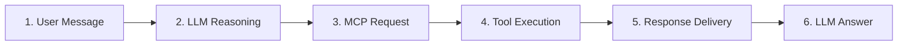
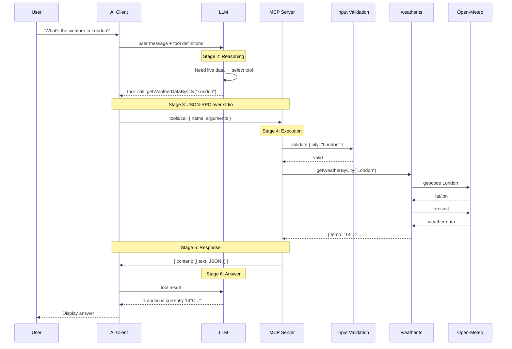

# MCP Request Flow — Step-by-Step Walkthrough

This document traces the complete lifecycle of an MCP request, from the user typing a message to seeing the final response.

---

## The Six Stages



---

## Stage 1: User Message

The user types a natural language question:

> "What's the weather in London?"

The AI client (Cursor) receives this message and prepares to send it to the LLM.

**What the client sends to the LLM:**

```json
{
  "messages": [
    { "role": "user", "content": "What's the weather in London?" }
  ],
  "tools": [
    {
      "name": "getWeatherDataByCity",
      "description": "Fetch live weather data for a city",
      "inputSchema": {
        "type": "object",
        "properties": {
          "city": { "type": "string", "description": "City name to fetch live weather for" }
        },
        "required": ["city"]
      }
    }
  ]
}
```

The client includes tool definitions from all configured MCP servers (custom weather, filesystem, memory) discovered during initialization. The LLM uses these definitions to decide which tool to call.

---

## Stage 2: LLM Reasoning

The LLM analyzes the user's intent:

1. The user is asking for current weather — this requires **live data**
2. The LLM does not have real-time weather information
3. A tool named `getWeatherDataByCity` is available that can fetch this data
4. The required parameter `city` can be extracted from the user message: `"London"`

**LLM decision:** Call the tool.

**LLM response to the client:**

```json
{
  "role": "assistant",
  "tool_calls": [
    {
      "id": "call_1",
      "name": "getWeatherDataByCity",
      "arguments": { "city": "London" }
    }
  ]
}
```

---

## Stage 3: MCP Request

The client translates the LLM's tool call into a JSON-RPC message and sends it to the MCP server over stdio:

**stdin → MCP Server:**

```json
{
  "jsonrpc": "2.0",
  "id": 1,
  "method": "tools/call",
  "params": {
    "name": "getWeatherDataByCity",
    "arguments": { "city": "London" }
  }
}
```

The MCP server receives this on stdin, parses it, and routes to the registered handler for `getWeatherDataByCity`.

---

## Stage 4: Tool Execution

The server processes the request:

### 4a. Input Validation

Zod validates the input against the declared schema:

```typescript
{ city: z.string() }
```

`"London"` passes validation. If the input were missing or the wrong type, the server would return a JSON-RPC error without executing the tool.

### 4b. Business Logic

The handler calls `getWeatherByCity("London")` from `weather.ts`:

1. **Geocode:** `GET https://geocoding-api.open-meteo.com/v1/search?name=London&count=1`
   - Response: `{ lat: 51.5085, lon: -0.1257, name: "London", country: "United Kingdom" }`

2. **Forecast:** `GET https://api.open-meteo.com/v1/forecast?latitude=51.5085&longitude=-0.1257&current=temperature_2m,relative_humidity_2m,weather_code,wind_speed_10m`
   - Response: `{ current: { temperature_2m: 14, relative_humidity_2m: 78, weather_code: 3, wind_speed_10m: 15 } }`

3. **Transform:** Map weather code `3` → `"Overcast"`, format temperature, etc.

### 4c. Result

```typescript
{
  temp: "14°C",
  humidity: "78%",
  weather: "Overcast",
  wind: "15 km/h",
  city: "London",
  country: "United Kingdom"
}
```

---

## Stage 5: Response Delivery

The server wraps the result in the MCP response format and writes it to stdout:

**stdout → Client:**

```json
{
  "jsonrpc": "2.0",
  "id": 1,
  "result": {
    "content": [
      {
        "type": "text",
        "text": "{\"temp\":\"14°C\",\"humidity\":\"78%\",\"weather\":\"Overcast\",\"wind\":\"15 km/h\",\"city\":\"London\",\"country\":\"United Kingdom\"}"
      }
    ]
  }
}
```

The client parses this and prepares to send the result back to the LLM.

---

## Stage 6: LLM Answer

The client sends the tool result back to the LLM:

```json
{
  "messages": [
    { "role": "user", "content": "What's the weather in London?" },
    { "role": "assistant", "tool_calls": [{ "id": "call_1", "name": "getWeatherDataByCity", "arguments": { "city": "London" } }] },
    { "role": "tool", "tool_call_id": "call_1", "content": "{\"temp\":\"14°C\",\"humidity\":\"78%\",\"weather\":\"Overcast\",\"wind\":\"15 km/h\",\"city\":\"London\",\"country\":\"United Kingdom\"}" }
  ]
}
```

The LLM reads the structured data and composes a natural language response:

> "London is currently 14°C with overcast skies. Humidity is at 78% and winds are blowing at 15 km/h."

The client displays this to the user.

---

## Complete Sequence Diagram



---

## Resource and Prompt Flows

### Resource Read (e.g., "What cities are supported?")

```
User → Client → LLM → (decides to read resource) → Client → MCP Server
MCP Server returns: "London\nNew York\nTokyo\nBerlin\nParis\nMumbai"
Client → LLM → (composes answer) → Client → User
```

JSON-RPC:

```json
{ "method": "resources/read", "params": { "uri": "weather://cities" } }
```

### Prompt Get (e.g., user selects "Ask about weather" for Berlin)

```
User selects prompt → Client → MCP Server
MCP Server returns: { messages: [{ role: "user", content: "What's the weather in Berlin?..." }] }
Client injects message into chat → normal tool call flow follows
```

JSON-RPC:

```json
{ "method": "prompts/get", "params": { "name": "weather-inquiry", "arguments": { "city": "Berlin" } } }
```
